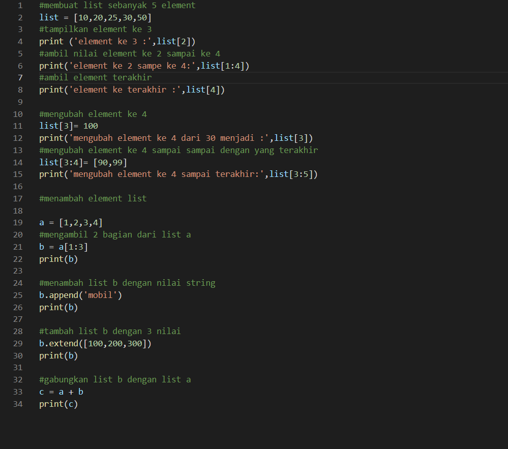
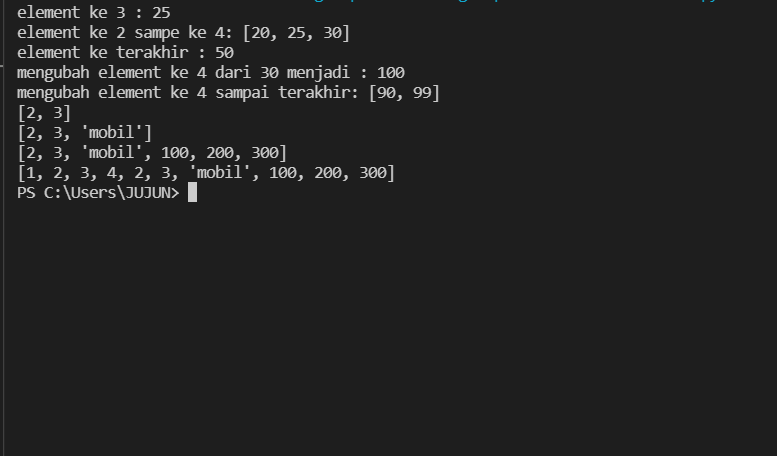
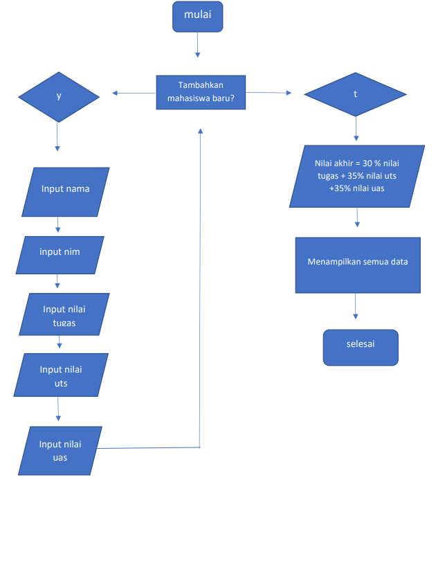
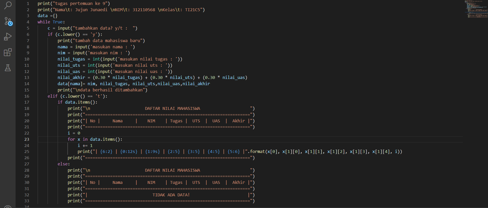
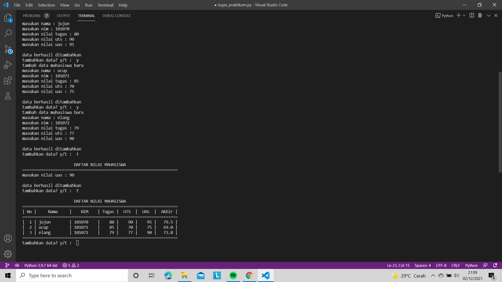

# tugas-pertemuan-ke-9
1. membuat list dengan 5 element \
```list = [10,20,25,30,50] ```
2. tampilkan element ke 3 \
```print ('element ke 3 :',list[2]) ```
3. mengambil element ke 3 sampai ke 4 \
```print('element ke 2 sampe ke 4:',list[1:4]) ```
4. mengambil element terakhir \
```print('element ke terakhir :',list[4])```
5. mengubah element ke 4 \
```list[3]= 100 ``` \
```print('mengubah element ke 4 dari 30 menjadi :',list[3]) ```
6. mengubah element ke 4 sampai sampai dengan yang terakhir \
```list[3:4]= [90,99] 
print('mengubah element ke 4 sampai terakhir:',list[3:5])
```


7. mengambil 2 bagian dari list a \
```a = [1,2,3,4]``` \
```b = a[1:3] ```\
print(b) 

8. menambah list b dengan nilai string \
```b.append('mobil')``` \
```print(b)```

9. tambah list b dengan 3 nilai \
```b.extend([100,200,300])``` \
```print(b)```

10. gabungkan list b dengan list a \
```c = a + b ``` \
```print(c) ```
\
\
Ini adalah program menggunakan visual studio : \
 \
dan ini adalah hasil dari program nya: \



# program sederhana untuk menambahkan data kedalam sebuah list
pertama saya akan menampilkan flowchartnya terlebih dahulu : \
 \

membuat inputan dan looping :
``` while true: ``` \
   ``` c = input("tambahkan data? y/t") ``` \
lalu membuat fungsi if apabila menginput 'y' \
``` if (c.lower() == 'y'): ```
```print('\ntambah data mahasiswa baru')``` \
```nama = input("masukan nama\t: ")``` \
```nim = input("masukan nim\t: ")``` \
```nilai_uts = int("input(masukan nilai uts"))``` \
```nilai_uas = int(input("masukan nilai uas"))``` \
```nilai_akhir = (0.30 * nilai tugas) + (0.35 * nilai uts) + (0.35 * nilai uas) ```\
```memasukannya kedalam list : ```\
```data[nama] = nim,nilai tugas,nilai uts,nilai uas,nilai akhir ```\
```print("data berhasil ditambahkan")``` \
membuat percabangan if apabila menginput "t" \
``` elif (c.lower() == 't'):                                                                    
        if data.items():                                                                     
            print("\n                      DAFTAR NILAI MAHASISWA                    ")
            print("==================================================================")
            print("| No |     Nama     |    NIM    | Tugas |  UTS  |  UAS  |  Akhir |")
            print("==================================================================")
            i = 0
            for x in data.items():
                i += 1
                print("| {6:2} | {0:12s} | {1:9s} | {2:5} | {3:5} | {4:5} | {5:6} |".format(x[0], x[1][0], x[1][1], x[1][2], x[1][3], x[1][4], i))  
            print("==================================================================")
        else:
            print("\n                      DAFTAR NILAI MAHASISWA                    ")
            print("==================================================================")
            print("| No |     Nama     |    NIM    | Tugas |  UTS  |  UAS  |  Akhir |")
            print("==================================================================")
            print("|                          TIDAK ADA DATA!                       |")
            print("==================================================================")
```
tambahkan else juga untuk menyetop looping: \
```else: ``` \
    ```break``` \
berikut adalah programnya di visual studio : \

\
dan ini hasilnya: \
